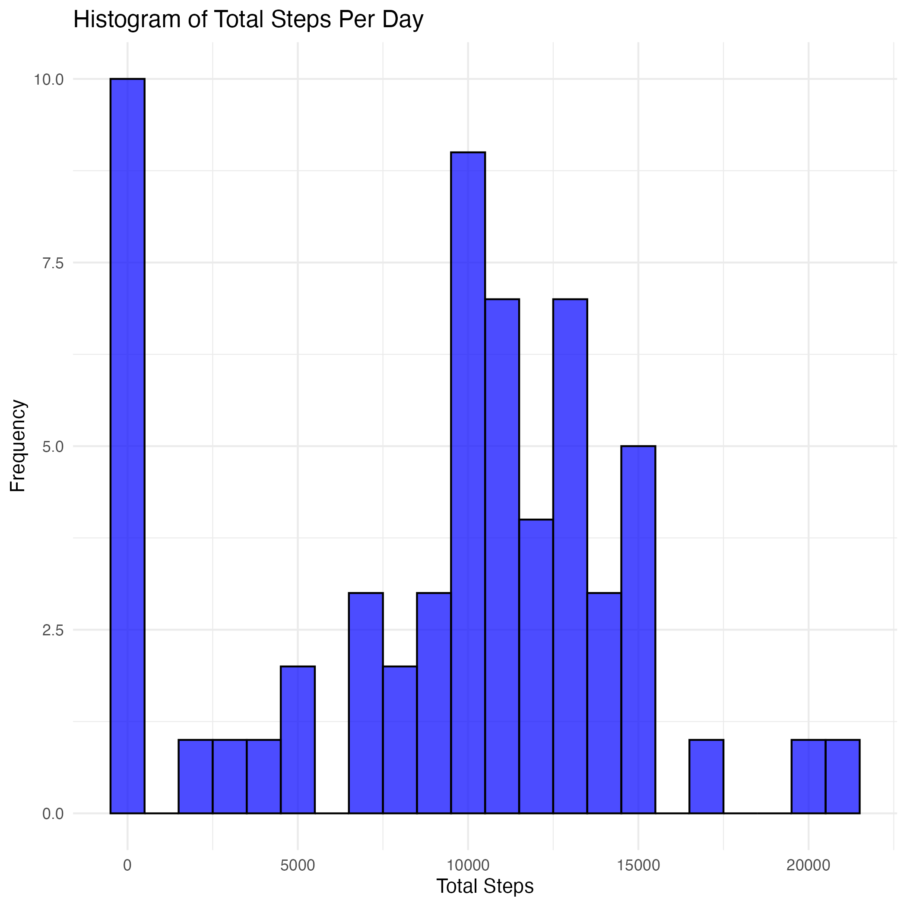
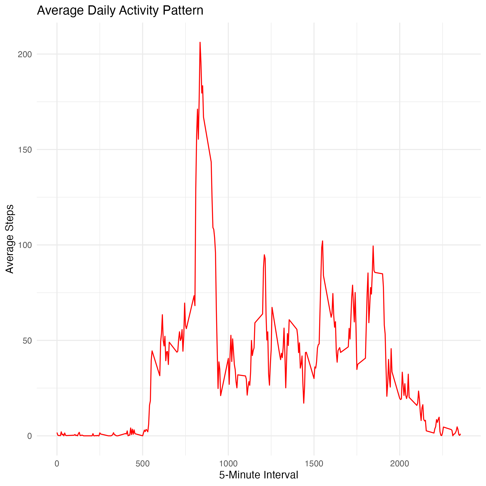
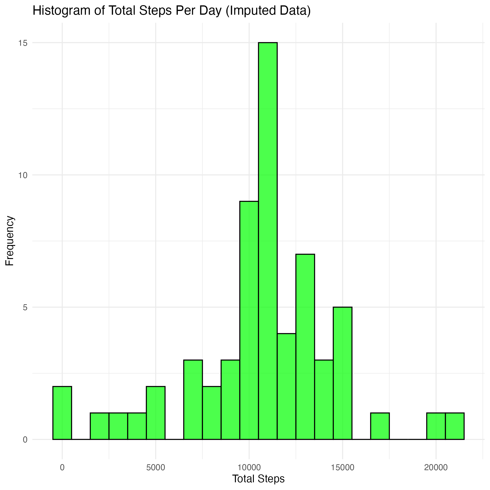
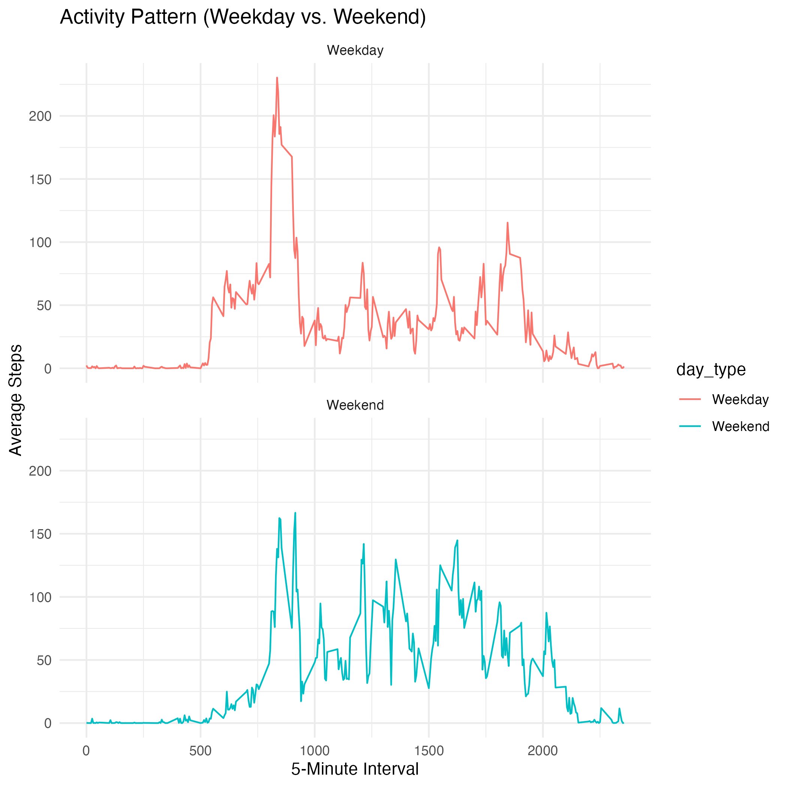

## **Loading and Preprocessing the Data**

```{r load_data, echo=TRUE}
library(dplyr)
library(ggplot2)

# Ensure figure directory exists
if (!dir.exists("figure")) {
  dir.create("figure")
}

# Unzip the dataset if not already extracted
zip_file <- "repdata_data_activity.zip"
csv_file <- "activity.csv"
if (!file.exists(csv_file)) {
  unzip(zip_file)
}

# Load the dataset
activity_data <- read.csv(csv_file, stringsAsFactors = FALSE)

# Convert date column to Date format
activity_data$date <- as.Date(activity_data$date, format="%Y-%m-%d")

# Display first few rows
head(activity_data)
```

## **Total Number of Steps Taken Per Day**

```{r total_steps_per_day, echo=TRUE}
# Summarize total steps per day
daily_steps <- activity_data %>%
  group_by(date) %>%
  summarise(total_steps = sum(steps, na.rm = TRUE))

# Save histogram of total daily steps
hist_plot <- ggplot(daily_steps, aes(x = total_steps)) +
  geom_histogram(binwidth = 1000, fill="blue", color="black", alpha=0.7) +
  labs(title = "Histogram of Total Steps Per Day", x = "Total Steps", y = "Frequency") +
  theme_minimal()
ggsave("figure/histogram_total_steps.png", plot = hist_plot)
```

## **Average Daily Activity Pattern**

```{r time_series_plot, echo=TRUE}
# Compute average steps per interval
interval_avg <- activity_data %>%
  group_by(interval) %>%
  summarise(avg_steps = mean(steps, na.rm = TRUE))

# Save time series plot
time_series_plot <- ggplot(interval_avg, aes(x = interval, y = avg_steps)) +
  geom_line(color="red") +
  labs(title = "Average Daily Activity Pattern", x = "5-Minute Interval", y = "Average Steps") +
  theme_minimal()
ggsave("figure/time_series_plot.png", plot = time_series_plot)
```

## **Imputing Missing Values**

```{r histogram_imputed, echo=TRUE}
# Histogram after imputation
daily_steps_imputed <- activity_imputed %>%
  group_by(date) %>%
  summarise(total_steps = sum(steps))

hist_imputed_plot <- ggplot(daily_steps_imputed, aes(x = total_steps)) +
  geom_histogram(binwidth = 1000, fill="green", color="black", alpha=0.7) +
  labs(title = "Histogram of Total Steps Per Day (Imputed Data)", x = "Total Steps", y = "Frequency") +
  theme_minimal()
ggsave("figure/histogram_imputed.png", plot = hist_imputed_plot)
```

## **Weekday vs. Weekend Activity**

```{r weekday_vs_weekend_plot, echo=TRUE}
# Compute average steps per interval for weekdays and weekends
interval_avg_daytype <- activity_imputed %>%
  group_by(interval, day_type) %>%
  summarise(avg_steps = mean(steps))

# Save panel plot
panel_plot <- ggplot(interval_avg_daytype, aes(x = interval, y = avg_steps, color=day_type)) +
  geom_line() +
  facet_wrap(~day_type, ncol=1) +
  labs(title = "Activity Pattern (Weekday vs. Weekend)", x = "5-Minute Interval", y = "Average Steps") +
  theme_minimal()
ggsave("figure/weekday_vs_weekend.png", plot = panel_plot)
```

## **Including Figures in Markdown**

```{r include_figures, echo=FALSE}
# Display saved figures inline in Markdown




```

